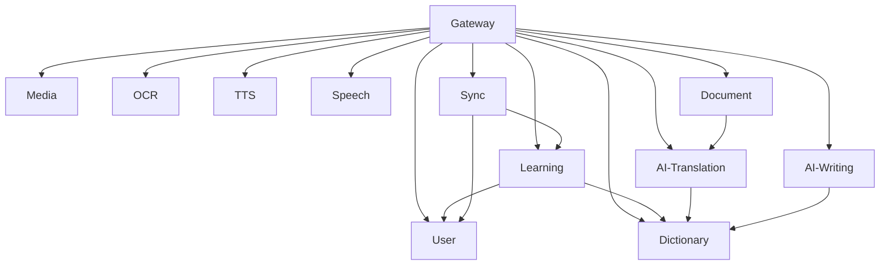

# 功能模块拆分详细说明

## 🎯 微服务拆分原则

### 1. **业务域驱动拆分**
基于欧路词典的核心功能，按照业务边界进行服务拆分，确保每个服务职责单一且业务完整。

### 2. **数据一致性考虑**
相关性强的数据放在同一个服务内，减少跨服务事务的复杂性。

### 3. **独立部署能力**
每个服务可以独立开发、测试、部署和扩容。

## 📊 服务功能映射

### 🔍 **dictionary** - 词典核心服务
**负责功能:**
- 词条查询和检索
- 词典数据管理
- 全文搜索索引
- 词形变化识别
- 同义词/反义词关联

**数据管理:**
- 词条表 (words)
- 释义表 (definitions)
- 例句表 (examples)
- 词典元数据 (dictionary_meta)
- 同义词关系 (synonyms)

```go
// 核心API接口
type DictionaryService interface {
    QueryWord(word string) (*WordResult, error)
    SearchWords(query string, limit int) ([]*WordResult, error)
    GetWordDetails(wordId string) (*DetailResult, error)
    FuzzySearch(term string) ([]*WordResult, error)
}
```

### 🤖 **ai-translation** - AI翻译服务
**负责功能:**
- 多AI引擎集成管理
- 翻译请求路由和负载均衡
- 翻译结果质量评估
- 自定义翻译风格配置
- 翻译缓存管理

**AI引擎适配:**
- OpenAI GPT系列
- Anthropic Claude
- Google PaLM
- 百度翻译
- 有道翻译

```go
type TranslationService interface {
    Translate(text, source, target, style string) (*TranslationResult, error)
    BatchTranslate(texts []string, source, target string) ([]*TranslationResult, error)
    GetSupportedLanguages() ([]Language, error)
    ConfigureEngine(userId string, config EngineConfig) error
}
```

### ✍️ **ai-writing** - AI写作辅助服务
**负责功能:**
- 语法错误检测和纠正
- 内容智能扩写
- 写作风格分析和建议
- 主题写作辅助

**核心模块:**
- 语法检查引擎
- 内容扩展算法
- 风格分析器
- 主题生成器

```go
type WritingService interface {
    CheckGrammar(text string) (*GrammarResult, error)
    ExpandContent(text string, style string) (*ExpansionResult, error)
    AnalyzeStyle(text string) (*StyleAnalysis, error)
    GenerateByTheme(theme, requirements string) (*GeneratedContent, error)
}
```

### 👤 **user** - 用户管理服务
**负责功能:**
- 用户注册、登录、认证
- 用户资料和偏好管理
- 权限控制和角色管理
- 账号安全和密码管理

**数据管理:**
- 用户基础信息 (users)
- 用户偏好设置 (user_preferences)
- 登录会话管理 (sessions)
- 权限角色配置 (roles, permissions)

```go
type UserService interface {
    Register(req RegisterRequest) (*UserInfo, error)
    Login(username, password string) (*AuthToken, error)
    GetProfile(userId string) (*UserProfile, error)
    UpdatePreferences(userId string, prefs UserPreferences) error
}
```

### 📚 **learning** - 学习管理服务
**负责功能:**
- 生词本创建和管理
- 学习进度跟踪记录
- 复习计划智能调度
- 学习效果数据分析
- 记忆曲线算法应用

**核心算法:**
- 艾宾浩斯遗忘曲线
- 间隔重复算法
- 难度自适应调整
- 学习路径优化

```go
type LearningService interface {
    CreateVocabulary(userId, name string) (*Vocabulary, error)
    AddWordToVocab(vocabId, wordId string) error
    GetReviewPlan(userId string) (*ReviewPlan, error)
    RecordStudySession(session StudySession) error
    AnalyzeLearningProgress(userId string) (*ProgressReport, error)
}
```

### 🎵 **media** - 多媒体服务
**负责功能:**
- 音频文件存储和管理
- 发音资源服务
- 例句音频关联
- CDN内容分发
- 媒体资源版本控制

**资源类型:**
- 单词发音 (pronunciation)
- 例句音频 (sentence_audio)
- 背景音乐 (background_music)
- 音效素材 (sound_effects)

```go
type MediaService interface {
    GetPronunciation(word, accent string) (*AudioResource, error)
    GetExampleAudio(exampleId string) (*AudioResource, error)
    UploadAudio(file AudioFile) (*AudioResource, error)
    GenerateAudioURL(resourceId string) (string, error)
}
```

### 📷 **ocr** - OCR识别服务
**负责功能:**
- 图片预处理优化
- 多语言文字识别
- 识别结果后处理
- 实时识别API
- 识别精度优化

**处理流程:**
1. 图片接收和预处理
2. OCR引擎识别
3. 结果校验和优化
4. 格式化输出

```go
type OCRService interface {
    RecognizeImage(image []byte, language string) (*OCRResult, error)
    RecognizeURL(imageURL, language string) (*OCRResult, error)
    GetSupportedLanguages() ([]string, error)
    PreprocessImage(image []byte) ([]byte, error)
}
```

### 🗣️ **tts** - 语音合成服务
**负责功能:**
- 文本转语音合成
- 多音源管理
- 语音流媒体服务
- 语音质量优化
- 个性化语音配置

**音源支持:**
- 男声/女声选择
- 不同口音支持
- 语速调节
- 音调控制

```go
type TTSService interface {
    TextToSpeech(text, voice string, config SpeechConfig) (*AudioStream, error)
    GetAvailableVoices() ([]Voice, error)
    StreamSpeech(text string, config StreamConfig) (<-chan AudioChunk, error)
}
```

### 🎤 **speech** - 语音评测服务
**负责功能:**
- 语音识别和分析
- 发音准确度评分
- 语音特征提取
- 发音改进建议
- 实时语音处理

**评测维度:**
- 准确度 (Accuracy)
- 流利度 (Fluency)
- 完整度 (Completeness)
- 重音和语调 (Stress & Intonation)

```go
type SpeechService interface {
    EvaluatePronunciation(audio []byte, referenceText string) (*EvaluationResult, error)
    AnalyzeSpeech(audio []byte) (*SpeechAnalysis, error)
    GetImprovementSuggestions(evaluation EvaluationResult) ([]Suggestion, error)
}
```

### 📄 **document** - 文档翻译服务
**负责功能:**
- PDF/Word文档解析
- 格式保持翻译
- 批量文档处理
- 翻译进度跟踪
- 文档版本管理

**支持格式:**
- PDF文档
- Word文档
- PowerPoint文档
- Excel表格
- 纯文本文档

```go
type DocumentService interface {
    UploadDocument(file DocumentFile) (*Document, error)
    TranslateDocument(docId, targetLang string) (*TranslationJob, error)
    GetTranslationProgress(jobId string) (*JobProgress, error)
    DownloadTranslatedDocument(jobId string) (*DocumentFile, error)
}
```

### 🔄 **sync** - 数据同步服务
**负责功能:**
- 跨平台数据同步
- 冲突检测和解决
- 增量同步优化
- 离线数据缓存
- 同步状态管理

**同步策略:**
- 实时同步 (WebSocket)
- 定时同步 (Cron Job)
- 手动同步 (User Trigger)
- 冲突解决 (Last Write Wins / Manual Resolution)

```go
type SyncService interface {
    SyncUserData(userId string, data UserData) (*SyncResult, error)
    ResolveSyncConflict(conflictId string, resolution ConflictResolution) error
    GetSyncStatus(userId string) (*SyncStatus, error)
    EnableRealtimeSync(userId string) error
}
```

### 🚪 **gateway** - API网关服务
**负责功能:**
- 请求路由和负载均衡
- 统一认证和鉴权
- 请求限流和熔断
- API版本管理
- 监控和日志记录

**核心特性:**
- JWT令牌验证
- 请求/响应转换
- 缓存策略
- 错误处理
- 文档聚合

```go
type GatewayService interface {
    RouteRequest(req *http.Request) (*http.Response, error)
    AuthenticateRequest(token string) (*AuthContext, error)
    ApplyRateLimit(userId string) error
    LogRequest(req RequestLog) error
}
```

## 🔗 服务间依赖关系



## 📈 性能和扩展性考虑

### 服务优先级分级
- **核心服务**: dictionary, user, gateway
- **功能服务**: ai-translation, learning, media
- **增强服务**: ai-writing, ocr, tts, speech, document, sync

### 扩容策略
- 核心服务: 多实例部署
- 功能服务: 按需扩容
- 增强服务: 资源隔离

### 缓存策略
- Redis集中缓存
- 本地缓存优化
- CDN静态资源

这种拆分方式确保了每个服务的独立性和可维护性，同时保持了业务逻辑的完整性。