# 字典/查词工具市场调研:功能、UI 与取词交互

调研时间 2026-10-08。范围 21 款产品,覆盖桌面客户端、在线词典、中文与多语种工具、间隔重复类四类。除特别注明外,文中截图均为当日用无头浏览器打开官方站点或在线版后实机截取,文件放在 `docs/research/assets/`,图片版权归各站点所有,仅作本项目内部对比。

多数站点截到了图,Merriam-Webster、Oxford Learner's Dictionaries、Wiktionary、Naver 词典四家对无头浏览器返回验证页、空白页或加载超时,这类产品只给文字结论,不配图,原因在表里写清。

## 一、产品盘点

| 产品 | 类型与平台 | 截图 | 主要来源 |
| --- | --- | --- | --- |
| 有道词典 | 商业综合客户端,Win/macOS/iOS/Android + 网页版 | `youdao_web.png` | [功能页](http://cidian.youdao.com/features/)、[桌面版帮助](https://cidian.youdao.com/5.0/help/deskdict5beta/description/01.html) |
| 金山词霸 / 爱词霸 | 商业客户端 + 网页版 iciba.com | `iciba.png` | [iciba 在线版](https://iciba.ijinshan.com/online/index.html)、[维基百科](https://zh.wikipedia.org/wiki/%E9%87%91%E5%B1%B1%E8%AF%8D%E9%9C%B8) |
| 必应词典 | 搜索引擎内置词典,网页版 | `bing_dict.png` | [cn.bing.com/dict](https://cn.bing.com/dict/) |
| 欧路词典 | 商业客户端,Win/macOS/Linux/iOS/Android | `eudic.png` | [产品页](https://www.eudic.net/v4/en/app/eudic)、[官方文档](https://docs.eudic.net/1/shi-yong-zhi-yin/tian-jia-kuo-chong-ci-ku) |
| GoldenDict-ng | 开源词库聚合器,Win/macOS/Linux | `goldendict_ng.png` | [官方文档](https://xiaoyifang.github.io/goldendict-ng/)、[LinuxLinks 评测](https://www.linuxlinks.com/goldendict-ng-advanced-dictionary-lookup-program/) |
| MDict | 商业词典阅读器,Win/iOS/Android | `mdict.png` | [官网](https://www.mdict.cn/) |
| StarDict / sdcv | 星际译王,含命令行版 sdcv | 无(项目已进入维护态) | [StarDict TODO 页](https://stardict-4.sourceforge.net/todo.php)、[开源离线词典汇总](https://wiloon.com/open-source-dictionaries/) |
| Anki | 开源间隔重复卡片,桌面/安卓/iOS/网页 | `anki.png` | [官网](https://apps.ankiweb.net/) |
| Merriam-Webster | 在线美式词典 | 无(无头浏览器被 Cloudflare 拦截) | [merriam-webster.com](https://www.merriam-webster.com/) |
| Cambridge Dictionary | 在线英汉/英英词典 | `cambridge.png` | [dictionary.cambridge.org](https://dictionary.cambridge.org/) |
| Oxford Learner's Dictionaries | 在线学习词典 | 无(返回空白页) | [oxfordlearnersdictionaries.com](https://www.oxfordlearnersdictionaries.com/) |
| Longman LDOCE | 在线英英词典,带频率与主题标记 | `longman.png` | [ldoceonline.com](https://www.ldoceonline.com/dictionary/proposal) |
| Linguee | 双语例句对照词典 | `linguee.png` | [linguee.com](https://www.linguee.com/)、[Google Play 说明](https://play.google.com/store/apps/details?hl=en_US&id=com.linguee.linguee) |
| DeepL | 左右分栏翻译,附词典区 | `deepl.png` | [deepl.com/translator](https://www.deepl.com/translator) |
| Wiktionary | 开源多语种词典 | 无(页面加载超时) | [en.wiktionary.org](https://en.wiktionary.org/) |
| 汉典 zdic | 在线汉语字典/词典 + 古籍字书 | `zdic.png` | [zdic.net](https://zdic.net/)、[站点梳理](https://stack.liuhuo.org/zh-hant/discover/zdic) |
| 百度汉语 | 在线汉语字词典 | `baidu_hanyu.png` | [hanyu.baidu.com](https://hanyu.baidu.com/) |
| 现代汉语词典 App | 商务印书馆官方 App,iOS/Android | `xiandai_hanyu_cidian_app.png` | [App Store](https://apps.apple.com/cn/app/id1330896529)、[定价争议报道](https://www.sohu.com/a/343817302_372465) |
| Pleco | 中文学习词典 App,iOS/Android | `pleco.png` | [官网](https://www.pleco.com/)、[App Store 说明](https://apps.apple.com/us/app/pleco-chinese-dictionary/id341922306) |
| Jisho | 在线日英词典 | `jisho.png` | [jisho.org](https://jisho.org/)、[FAQ](https://jisho.org/faq) |
| Naver 词典 | 在线韩英/韩中词典 | 无(页面空白渲染失败) | [dict.naver.com](https://dict.naver.com/)、[高校图书馆使用指南](https://guides.libraries.emory.edu/c.php?g=50404&p=7228209) |

## 二、六条贯穿产品的交互主线

### 1. 输入:拼写之外还有多少入口

英文查词基本只有键盘拼写加自动补全,所以有道、必应、Linguee 的输入框长得都差不多:一个框、一个下拉建议列表、语言方向自动识别。差别在于纠错与容错,例如 Linguee 只输前几个字母就出结果并自动容错,GoldenDict-ng 用 Hunspell 做词形还原来跳过时态与复数([功能列表](https://xiaoyifang.github.io/goldendict-ng/)),它还做了 Unicode 折叠,输入 `Grussen` 能命中 `grüßen`。

到了中文、日文,输入方式立刻分裂成一排入口。现代汉语词典 App 的检索维度有单字、词语、拼音、部首、笔画数、四角号码、手写、语音、拍照九类([App Store 说明](https://apps.apple.com/cn/app/id1330896529));汉典在同一页面挂了部首索引、总笔画、拼音、注音,外加汉字拆分、五笔、仓颉、四角号码、Unicode 等查字法([站点梳理](https://stack.liuhuo.org/zh-hant/discover/zdic));Pleco 的入口是汉字、拼音(声调可省)、英文、手写、OCR 五种,搜索框下方常驻画笔与摄像头按钮([App Store 说明](https://apps.apple.com/us/app/pleco-chinese-dictionary/id341922306))。

Jisho 把这件事推得更远:搜索框下方固定放 Draw、Radicals、Voice 三个按钮,英文、罗马字、假名、汉字都能直接搜,整句粘进去会自动切词分段展示(`jisho.png`)。

### 2. 触发:屏幕取词、划词、浮窗、热键

四件事常被混着说,实际是四个开关。有道桌面版把它们做成了开关矩阵:屏幕取词、划词翻译各有独立开关,支持浏览器、图片、PDF,并有 OCR 取词与词组智能取词([功能页](http://cidian.youdao.com/features/))。欧路走的是"复制即查"路线,复制其他软件中的文字后打开欧路会自动查,截屏或拍照后打开也会提示翻译图片,官方文档称之为 LightPeek 跨软件取词([软件介绍](https://dict.eudic.net/areas/gitbook/1.html));它还提供 `eudic://dict/word` 这样的 URL scheme 供外部调用([更新日志](https://www.eudic.net/v4/en/app/history?appkey=eusoft_eudic_en))。

GoldenDict-ng 的取词叫 Scan Popup,选中文字弹浮窗,另加全局热键呼出查词窗口([LinuxLinks 评测](https://www.linuxlinks.com/goldendict-ng-advanced-dictionary-lookup-program/))。

真实体验里这条线最不稳。有位用户对比有道与欧路时提到,macOS 下屏幕取词在部分软件中定位不准、偶发无响应,有道更是"完全没有成功使用过",划词搜索又受快捷键设置影响,效率不高([对比讨论](https://github.com/kaiye/kaiye.github.com/issues/5))。另一篇对比提到欧路自带划词翻译表现一般,即便添加了第三方翻译引擎,划词仍走自带通道,无法替换([V2EX 讨论](https://v2ex.com/t/821603))。这两条是同一类问题:取词链路跨进程、跨权限,做得再全也难保证稳定,产品上更适合给用户明确的开关和兜底方式。

### 3. 结果呈现:单栏流、分栏、多词典并列

三种主流排布。

单栏纵向流是网页词典的默认形态。有道在左侧给了"释义/权威词典/用法/例句"目录锚点,正文里再用"网络释义/专业释义/英英释义"标签切换,右侧挂词组短语栏(`youdao_web.png`)。金山词霸是"简明/AI释义/AI解词"三个标签,右侧是释义、词态变化、例句、英英释义的跳转栏(`iciba.png`)。必应词典则把 Advanced E-C、C-E、E-E、Web Definition 做成底部标签,搭配与同义词单独成块(`bing_dict.png`)。

左右分栏是翻译类产品的默认形态。DeepL 左边输入、右边译文,左下角附一块 Dictionary(`deepl.png`);Linguee 现在也并进了 DeepL 的导航,顶部就是 Translator/Write/Dictionary 三个标签,主区显示词条加常见译法、少见译法和例句组(`linguee.png`)。

多词典并列是"词库容器"类的招牌。GoldenDict-ng 把多本词典的结果放在同一页,支持把网站、外部程序、音频集当成词典源,并用 Xapian 做跨词典全文检索([官方文档](https://xiaoyifang.github.io/goldendict-ng/))。欧路的全文搜索要先在"词典库管理"里逐本打开索引,等索引完成才能在解释页看到结果([官方文档](https://docs.eudic.net/1/shi-yong-zhi-yin/dan-ci-cha-xun/quan-wen-sou-suo-1))。这个逐本开索引的设计说明全文检索的成本由用户承担,产品上要么默认帮用户建好,要么把等待时间说清楚。

### 4. 生词本:格式、同步与复习曲线

三家的导入口径不一致,是实际迁移的主要摩擦点。有道生词本支持 .bin/.xml/.txt 导入,可导出 .bin/.xml/.txt/.doc,并与服务器实时同步([知乎回答](https://www.zhihu.com/question/19627547/answer/76589623));欧路能导入金山词霸的 .txt、有道的 .xml 和普通 txt,也做云端同步(同上)。两边都不认对方的主格式,想换工具只能靠 txt 中转。

复习功能基本成了标配。有道把艾宾浩斯遗忘曲线做进单词本,支持导入四六级词库直接复习([功能页](http://cidian.youdao.com/features/));Pleco 的闪卡系统支持 SRS、填空与声调训练,任何词条一键成卡([App Store 说明](https://apps.apple.com/us/app/pleco-chinese-dictionary/id341922306));Anki 干脆把查词排除在定位之外,它是纯卡片引擎,靠 AnkiWeb 与插件生态扩展([官网](https://apps.ankiweb.net/))。GoldenDict-ng 也做了 Anki 集成,词条可以直接变成卡片([官方文档](https://xiaoyifang.github.io/goldendict-ng/))。

### 5. 离线与在线的分工

欧路把离线当成卖点,内置英汉常用词条 30 万、专业词条 40 万、例句 50 万条且离线可查([产品页](http://www.eudic.net/v4/en/app/eudic))。有道相反,网络释义、百科、例句大多依赖联网,免费版带广告且可手动关闭([桌面版帮助](https://cidian.youdao.com/5.0/help/deskdict5beta/description/01.html))。这条分歧直接影响 UI:离线优先的产品要把词库状态(已下载/未下载)放进主界面,联网优先的产品则要处理超时、空结果和广告位。

在线权威词典是另一套逻辑。Cambridge、Longman、Oxford 的内容本身就在服务器上,交互保守但排版稳定,频率标记、主题标签、例句音频齐全,例如 Longman 给词条标 S3/W3 频率与 Family 主题(`longman.png`)。代价是内容受付费墙与反爬限制,本次调研里 Merriam-Webster 与 Oxford 就没截到图。

### 6. 词库格式生态

桌面端产品的差异主要落在这里。MDX/MDD(MDict)、DSL(灵格斯)、BGL(Babylon)、StarDict、ZIM(Kiwix)五种格式在多个客户端之间通用:GoldenDict-ng 全部支持([官方文档](https://xiaoyifang.github.io/goldendict-ng/));欧路支持 MDict、灵格斯、Babylon 并提供词库编辑器([官方文档](https://docs.eudic.net/1/shi-yong-zhi-yin/tian-jia-kuo-chong-ci-ku));MDict 自己是 MDX 的原生客户端(`mdict.png`)。StarDict 的 .ifo/.idx/.dict 三件套格式至今仍在被转写,连命令行工具 sdcv 也还在维护([汇总表](https://wiloon.com/open-source-dictionaries/)),不过 StarDict 本体的开发已进入只做维护的阶段([TODO 页](https://stardict-4.sourceforge.net/todo.php))。

开放数据侧,ECDICT 这类词库把 CSV、SQLite、StarDict、MDX 互相转换,标注了四六级/雅思/托福大纲、柯林斯星级、牛津 3000、BNC/COCA 词频([仓库](https://github.com/skywind3000/ECDICT))。做客户端时,词库格式的兼容面比界面样式更决定能装进多少内容。

## 三、中文与多语种

中文与多语种不是英文查词的翻译版,检索维度、取词对象、界面密度都不一样,值得单列。

**检索维度的数量级差异。** 英文词条只有一个词头,中文单字有拼音、注音、部首、笔画数、结构、Unicode、五笔、仓颉、四角号码一堆属性,汉典把它们全放在条目头一行行对齐(`zdic.png`)。百度汉语则把"基本释义/详解/词典释义"分层,近反义词、组词、例句紧跟其后,右侧留热搜字词栏(`baidu_hanyu.png`)。同样一个搜索框,中文产品的结果页要比英文产品多出两到三个信息块。

**纸书的检索路径被原样搬进 App。** 现代汉语词典 App 保留了原版翻阅模式,又叠加关键词检索,并把部首、笔画、四角号码、手写这些传统查字法全部做成数字入口,同时补上语音、拍照两种新入口([App Store 说明](https://apps.apple.com/cn/app/id1330896529))。这类"两种模式并存"的排布在英文产品里几乎见不到,因为英文没有部首和笔顺。App Store 页面显示该 App 评分 4.2、5952 个评分(`xiandai_hanyu_cidian_app.png`);它 98 元的定价当时引发过争议([报道](https://www.sohu.com/a/343817302_372465)),说明中文用户愿意为权威辞书数字版付的钱有明确上限。

**中英双向的"双向"是输入方向问题。** 有道桌面版支持中英法日韩五语互译,并把取词划词与翻译做成语言自动识别([桌面版帮助](https://cidian.youdao.com/5.0/help/deskdict5beta/description/01.html));欧路同样是英汉汉英双向,内置 WordNet 英英释义与同义反义词库([产品页](http://www.eudic.net/v4/en/app/eudic))。自动识别在中文场景的失败模式更烦人:输入一个英文短语却按汉语解释,或者反过来,所以有道、必应都在搜索框上放了显式的中英/英中切换。

取词对象也不一样。英文取词要处理词形变化,`proposals`、`proposed` 都得跳回 `proposal`,GoldenDict-ng 用 Hunspell 做形态分析、欧路也内置词形处理([LinuxLinks 评测](https://www.linuxlinks.com/goldendict-ng-advanced-dictionary-lookup-program/))。中文没有词形变化,取词难点变成切词边界:一个四字成语、一个专名、一段文白夹杂的句子,切错就查不到。中文取词还常伴随 OCR 场景,菜单、路牌、扫描件都要能拍了就查,Pleco 的实时 OCR 是付费一次性买断,拍照后在取景框上直接盖释义([评测](https://hsklord.com/blog/pleco-review))。

各语种的输入习惯也不同。日语里假名、罗马字、汉字混写,句子中间不空格,Jisho 的做法是整句搜索、结果自动切词,再用 `#common`、`#name`、JLPT 等标签过滤,汉字还有手写与部首两条兜底([Tofugu 评测](https://www.tofugu.com/japanese-learning-resources-database/jisho-org/)、[FAQ](https://jisho.org/faq))。韩语侧 Naver 词典支持手写、语音、图片三种输入([使用指南](https://guides.libraries.emory.edu/c.php?g=50404&p=7228209))。繁简与注音也是中文产品的必答题:Pleco 全模块支持繁简,读音可选拼音或注音,部分词典收粤语([Google Play 说明](https://play.google.com/store/apps/details/Pleco_Chinese_Dictionary?id=com.pleco.chinesesystem&hl=zh_CN));汉典提供简繁切换与深色模式([站点梳理](https://stack.liuhuo.org/zh-hant/discover/zdic))。

这一节的结论是:任何声称"多语种"的查词工具,第一版就得决定检索维度的数据结构能不能装下部首、笔画、注音、假名读音这些字段,以及 OCR 和手写是内置还是留给插件。等到英文版做完再补中文,结果页的信息架构几乎要重做一遍。

## 四、几类产品各自的取舍

有道、金山、必应这一档综合型客户端功能最全、联网最快,AI 释义上得早,代价是广告、会员与功能堆叠。有道把网络释义、专业释义、英英释义分层,并把手动关闭广告做进了帮助文档;金山把"简明/AI释义/AI解词"三个标签放在首屏。它们的共同点是首屏信息密度高,靠标签页和右侧栏把内容塞进去。

GoldenDict-ng、欧路、MDict 属于词库容器,内容上限由用户导入的词库决定,界面服务于"多本并列+全文检索",配置成本也高。欧路的全文搜索要逐本开索引,GoldenDict-ng 要自己准备 MDX/DSL/StarDict/ZIM 文件。它们没有网络释义这类云端能力,但离线与格式兼容是硬优势。

Cambridge、Longman、Oxford、Merriam-Webster 这类在线权威词典的释义与例句质量最高,排版克制,频率与主题标注体系成熟;反爬、付费墙与广告位是使用摩擦,无头浏览器环境下本次就有两家截不到图。

Linguee 与 DeepL 走语料对照路线,卖点是真人译文例句而非单条释义。Linguee 强调词条来自 400 多位词典编纂者的编辑词典与十亿级翻译对照([Google Play 说明](https://play.google.com/store/apps/details?hl=en_US&id=com.linguee.linguee)),DeepL 卖的是译文质量与文档翻译,词典区只是附属面板。它们的输入框就是主界面,查词动作被压缩到一屏之内。

Anki、Pleco 闪卡、有道单词本属于学习型,查词只是入口,复习才是目的。差异在开放度:Anki 全开放、靠插件与共享卡组扩展;Pleco 的手写、OCR、笔顺动画、部分词典是付费插件;有道把复习绑在自家账号与词库上。

## 五、对本项目的可借鉴清单

1. 多词典并列 + 分组标签是被反复验证的形态,GoldenDict-ng 与欧路都这么做,首屏应预留"同词多源"的排布。
2. 划词、屏幕取词、浮窗、全局热键是四个独立开关,分开控制比一个总开关更符合实际使用习惯;跨进程取词的失败要能被用户感知并手动兜底。
3. 中文的检索维度(拼音、注音、部首、笔画、四角号码、手写、OCR)要在数据结构阶段就留位,不能等英文版跑通再补。
4. 生词本的导入导出至少支持通用 txt,否则用户换工具时搬不走数据;有道与欧路的格式互不认账是现成的反面例子。
5. 全文检索无论用哪个现成库,索引构建的进度与耗时要对用户可见,欧路逐本开索引的做法说明这件事不能默默做。
6. 在线抓取不可靠:权威站点有反爬与付费墙,离线词库与本地索引应当是主路径,在线结果作为补充。
7. 词库格式兼容面(MDX/DSL/StarDict/ZIM)决定能装进多少内容,比界面样式更优先。

## 附:截图

全部位于 `docs/research/assets/`,2026-10-08 实机截取,按主题列出。

中文综合客户端:

图 1 有道词典网页版 proposal 词条,左侧是释义/权威词典/用法/例句目录,正文按网络释义、专业释义、英英释义分标签,右侧挂词组短语。

图 2 爱词霸 iciba 词条页,简明/AI释义/AI解词三个标签,右栏是释义、词态变化、例句、英英释义的跳转。

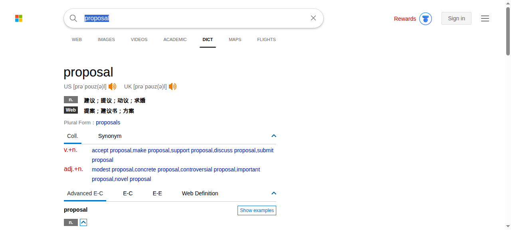

图 3 必应词典 DICT 标签页,底部有 Advanced E-C、C-E、E-E、Web Definition 四个切换,搭配与同义词单独成块。

图 4 欧路词典官方产品页,右侧是移动端界面示意。

词库容器:

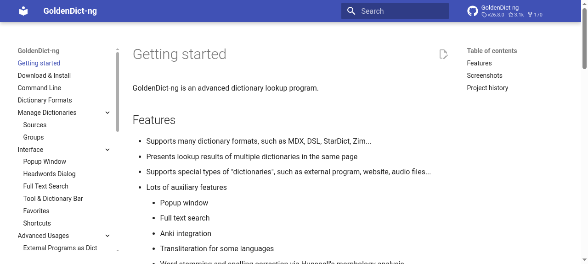

图 5 GoldenDict-ng 官方文档首页,左侧导航列出弹窗、词条列表、全文检索等界面章节。

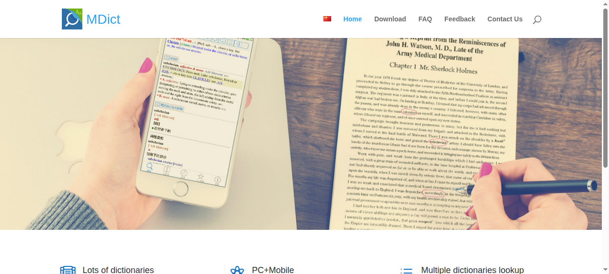

图 6 MDict 官网首屏,手机端词条页与纸质书对照的产品图。

在线英美词典:

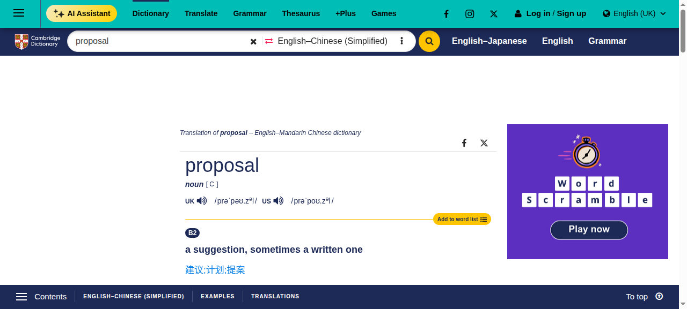

图 7 Cambridge Dictionary 英汉(简体)词条页,含发音、释义、例句与翻译标签。

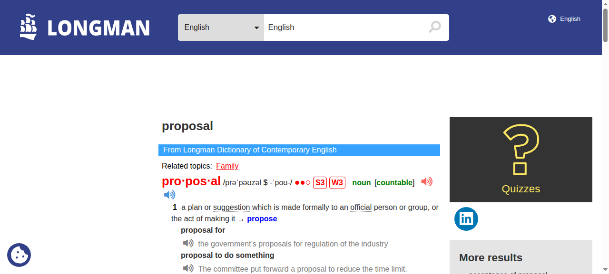

图 8 Longman LDOCE 词条页,S3/W3 频率标记、主题标签与例句音频。

语料对照:

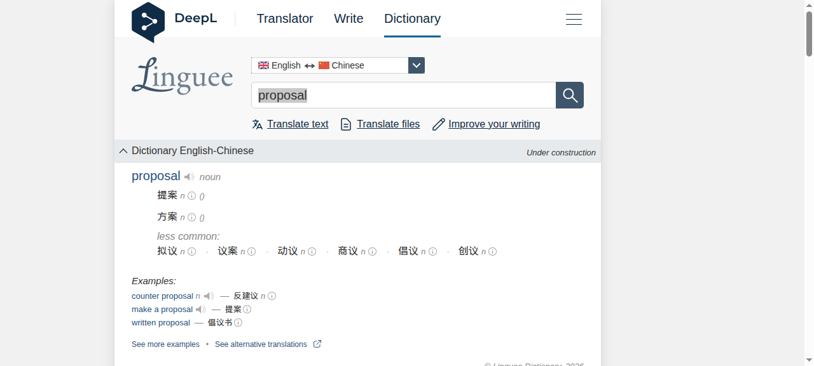

图 9 Linguee 词条页,现已并入 DeepL 导航,主区是常见译法、少见译法与例句组。

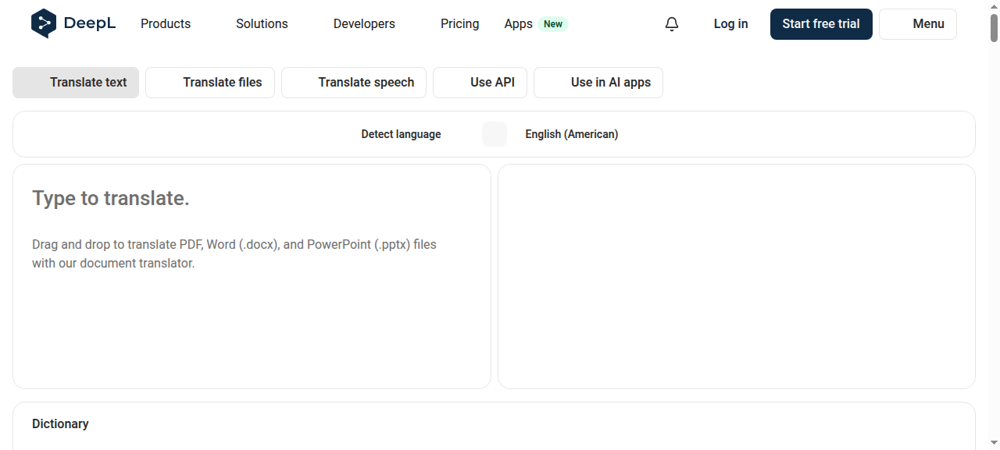

图 10 DeepL 翻译界面,左右分栏,左下角附 Dictionary 区。

中文与多语种:

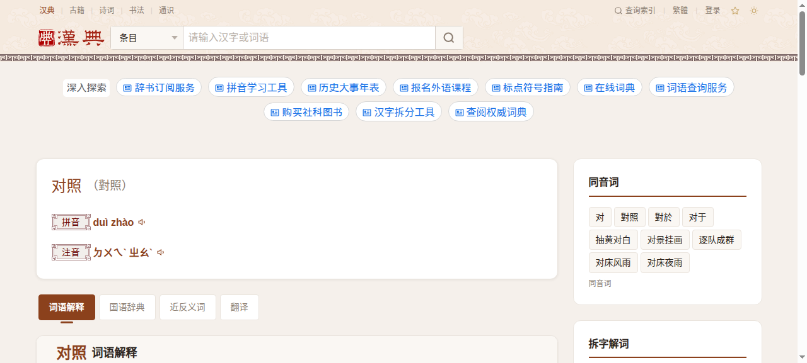

图 11 汉典"对照"词条,条目头对齐排列拼音、注音、部首、笔画、Unicode,正文分词语解释、国语辞典、近反义词、翻译四个标签。

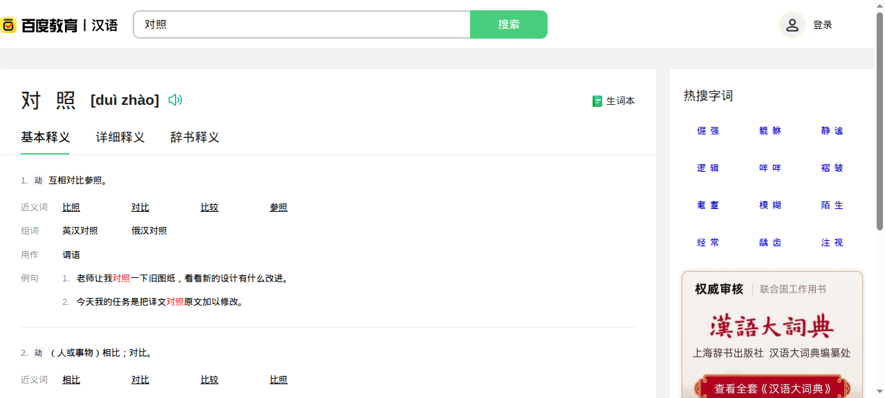

图 12 百度汉语"对照"词条,基本释义/详解/词典释义分层,右侧是热搜字词栏。

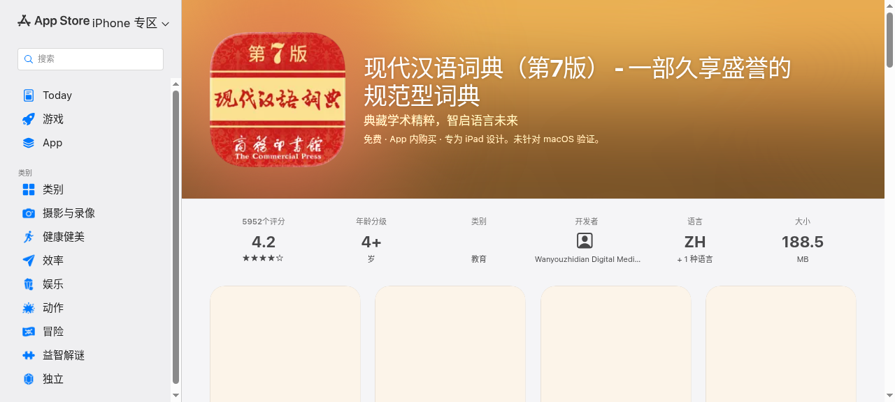

图 13 App Store 上的《现代汉语词典》App 页面,评分 4.2、5952 个评分。

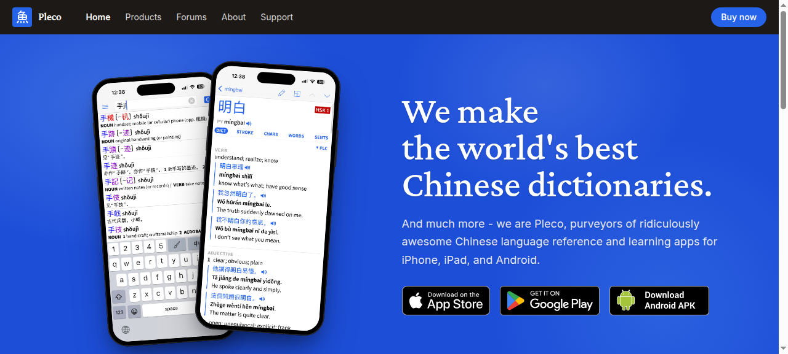

图 14 Pleco 官网首屏,左侧手机展示词条页,右侧展示手写输入键盘。

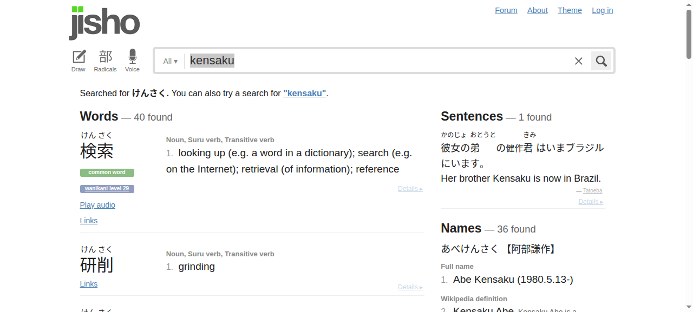

图 15 Jisho 搜索结果,搜索框下方常驻 Draw、Radicals、Voice 三个入口,右侧是例句与人名两栏。

学习型:

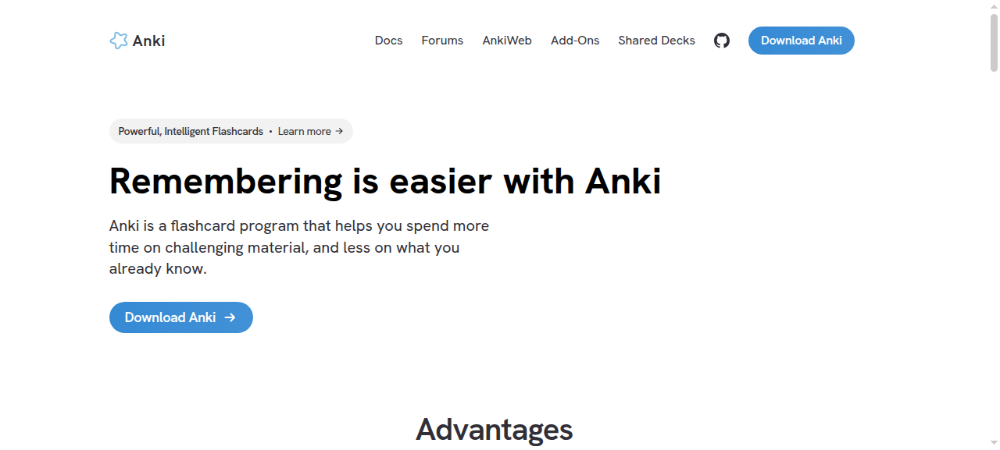

图 16 Anki 官网首页。

未能截图的 5 款(Merriam-Webster、Oxford Learner's Dictionaries、Wiktionary、Naver 词典、StarDict)原因见第一节表格。
