# 词典客户端 UI 调研：欧路词典 / GoldenDict / MDict（桌面 + 手机）

> 调研日期 2026-10-10 · 目的：为 unidict UI 改版提供可参考的真实客户端界面依据。
> 口径：**只用桌面客户端与手机客户端的真机界面图**，官方应用商店截图 / 官方文档截图为准，**网页版一律不算**（上一轮调研用网页版充数被否，本轮全部替换为客户端截图）。

## 一、调研对象与图片来源

| 产品 | 形态 | 截图来源 | 张数 |
|---|---|---|---|
| 欧路词典 Eudic | 桌面（macOS 客户端） | iTunes App Store「Eudic 欧路词典」macOS 版官方截图（App Store 页面 800×500 截图， Apple CDN） | 6 |
| 欧路词典 Eudic | 手机（iOS 客户端） | iTunes App Store「欧路词典」iOS 版官方截图（Apple CDN） | 5 |
| GoldenDict-ng | 桌面（Win/mac/Linux 客户端） | GoldenDict-ng 官方文档站 xiaoyifang.github.io/goldendict-ng/img/（项目官方 hero 图与文档内嵌图） | 5 |
| MDict | 手机（iOS 客户端） | iTunes App Store「MDict」iOS 版官方截图（Apple CDN） | 5 |
| MDict | 桌面（Windows 客户端） | MDict 官网 mdict.cn 宣传图（唯一官方图，**非纯净 UI 截图**，见下注） | 1 |

> **MDict 桌面说明**：MDict 官网（mdict.cn）与下载页均**不发布纯净的 Windows 桌面 UI 截图**，仅有一张宣传图（手机+书本场景，内嵌一小块手机界面）。本轮如实标注为宣传图，不冒充桌面 UI 截图。GoldenDict-ng 为**纯桌面项目，无手机 App**——这本身是市场结论，见第四节。

四件套口径（每张图）：**布局 / 色彩 / 信息密度 / 导航** → 可借鉴 / 不适用（含为什么）/ 落到 unidict 哪个界面。

---

## 二、欧路词典 Eudic（主参照：桌面 + 手机双形态）

### 2.1 桌面端（macOS 客户端）

#### 图 1 · 查词主窗
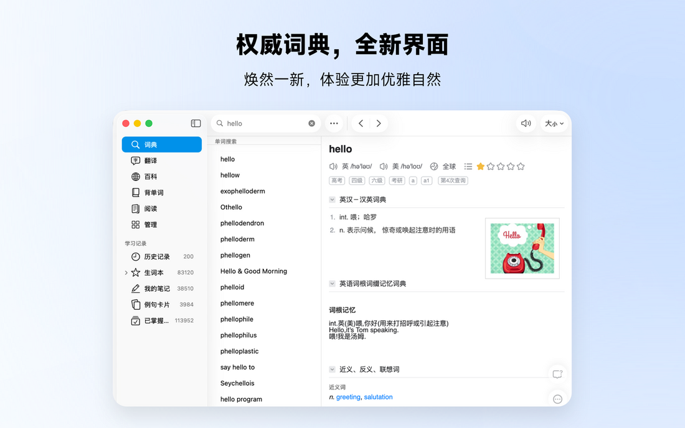
来源：App Store「Eudic 欧路词典」macOS 版官方截图（Apple CDN 800×500 原图）。

- **布局**：三栏。左栏=词典分组树（权威词典/扩充词库，可折叠）；中栏=词条详情（词头+音标+释义+例句+词组+近义联想+笔记，分区折叠）；右栏=生词本/学习面板。顶栏=搜索框+模式切换。
- **色彩**：浅色主题，白底+浅灰分区，蓝色高亮选中项，整体低饱和、大量留白。
- **信息密度**：中栏高（一屏多分区折叠），左右栏低。密度靠「折叠分区」而非「缩小字号」控制。
- **导航**：左栏切词典、中栏内折叠分区、顶栏搜索。层级清晰，无模态打断。
- **可借鉴**：① 中栏「词头+音标+多分区折叠」的详情组织方式 → 落到 unidict 桌面**结果页 EntryResultsPane**（现已有词典折叠分组，可再加分区内小节折叠）；② 右栏常驻生词本/学习面板 → 落到 unidict 桌面**侧栏生词本 tab**（现是 tab 切换，可考虑窄屏常驻预览）；③ 左栏词典分组树 → 落到 unidict **词典管理/分组**。
- **不适用**：右栏「学习记录+图表」属欧路的自研学习体系（进度/熟练度统计），unidict 定位离线查询、无学习进度产品，**不引入**（roadmap §A 已弃学习统计/成就）。

#### 图 2 · 词典管理（扩充词库）
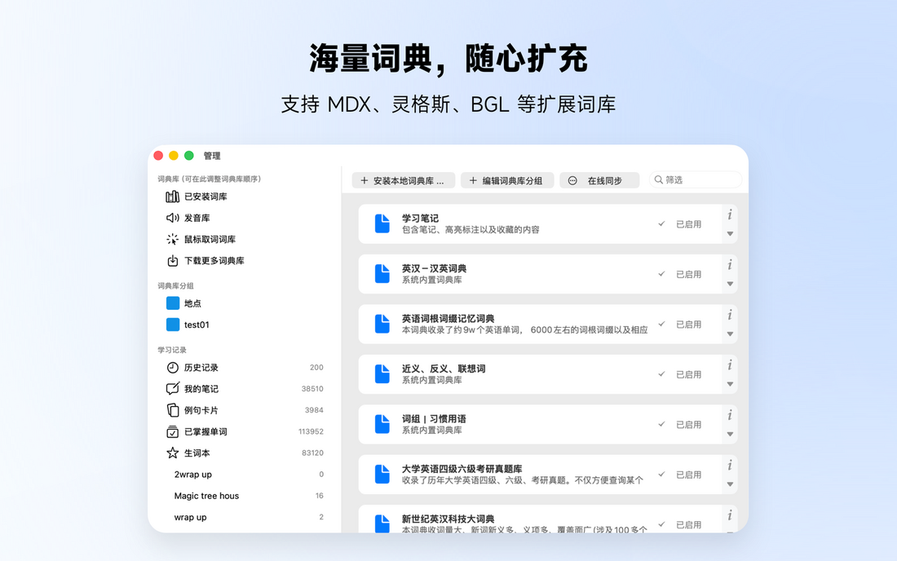
来源：同上（App Store macOS 版官方截图）。

- **布局**：左栏分组树 + 右栏词典列表（复选框勾选启用/停用），顶部「管理」入口。
- **色彩**：浅色，选中行浅蓝底，复选框蓝勾。
- **信息密度**：低，列表式，一行一词典。
- **导航**：左栏切分组、右栏勾选。
- **可借鉴**：① 「复选框启用/停用词典」的轻量管理 → 落到 unidict **设置抽屉「词典」tab / gui 工具栏分组下拉**（现已有优先级/分组，可加启用开关）；② 分组树与列表联动 → unidict 已有分组，可补树形可视化。
- **不适用**：欧路的「扩充词库下载」是在线商店，unidict 离线优先、无在线商店（P-10 gated），**不引入**。

#### 图 3 · 生词本（表格视图）
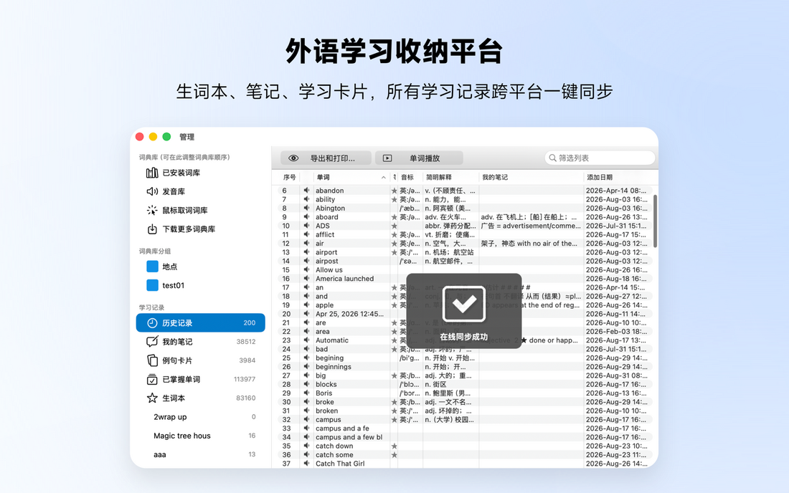
来源：同上（App Store macOS 版官方截图）。

- **布局**：表格式生词本，列=单词/释义/添加时间/熟练度，行内可操作；图中有右键/悬浮操作浮层（深色小浮窗）。
- **色彩**：浅色，表头浅灰，悬浮浮层深色（对比突出）。
- **信息密度**：中，表格紧凑但不拥挤。
- **导航**：表格排序+筛选+行内操作。
- **可借鉴**：① 「单词+释义+添加时间+熟练度」多列表格 → 落到 unidict 桌面**生词本**（现是卡片式，可补表格视图切换，便于批量浏览）；② 行内悬浮操作浮层 → unidict 卡片上已有「+标签/笔记」轻动作，可补行内快捷操作。
- **不适用**：「熟练度」列属欧路学习体系，unidict 无此概念，**不引入**该列。

#### 图 4 · 单词卡片（记忆/复习）
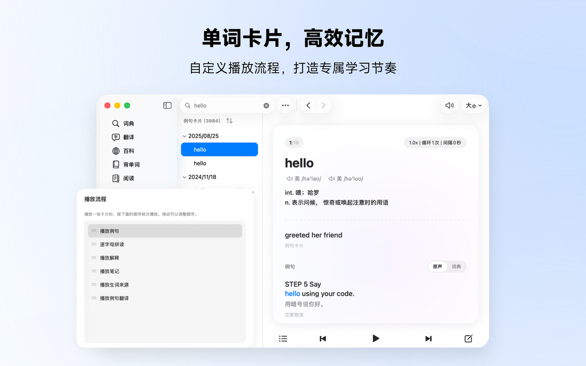
来源：同上（App Store macOS 版官方截图）。

- **布局**：居中大字卡：词头+音标+词性+释义，底部「认识/模糊/忘记」三档按钮，顶部进度条。
- **色彩**：浅色卡片+蓝色主按钮，大量留白，聚焦单字。
- **信息密度**：极低，一屏一词。
- **导航**：底部三档自评驱动翻页。
- **可借鉴**：① 「认识/模糊/忘记」三档自评的极简卡片 → unidict 定位离线查询，**复习/遗忘曲线已按 §A 放弃**，但若未来要做轻量复习，此三档是最简范式；② 大字留白的卡片美学可借到 unidict **结果页词条卡头**（现卡头已升级，可再强化词头视觉层级）。
- **不适用**：整套「背单词/复习」流程与 unidict 定位冲突（§A），**不引入**。

#### 图 5 · 鼠标自动取词（浮窗）
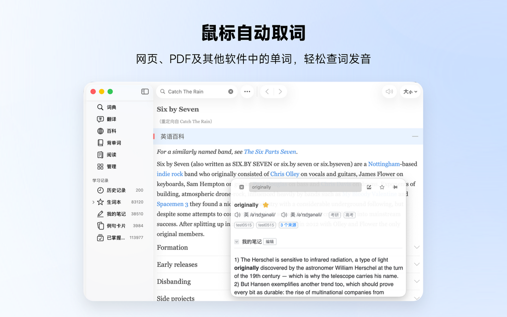
来源：同上（App Store macOS 版官方截图）。

- **布局**：文档/网页之上悬浮小窗：词头+音标+释义+发音按钮+「加入生词本」，半透明深色，贴光标。
- **色彩**：深色半透明浮层，与底层文档形成对比。
- **信息密度**：低，只给核心释义。
- **导航**：浮窗内轻操作（发音/收藏），失焦即收。
- **可借鉴**：① 贴光标小浮窗+半透明深色+核心释义 → 直接对标 unidict **悬浮取词窗 QuickLookupPane**（已交付，可对照优化信息层级：词头/音标/释义/发音/生词本的排布）；② 半透明深色在浅色文档上的可读性处理。
- **不适用**：欧路取词触发是「鼠标悬停自动取词」，unidict 是剪贴板/热键取词（悬停已按 §A 放弃），**触发方式不引入**，仅借鉴浮窗视觉。

#### 图 6 · AI 大模型翻译

来源：同上（App Store macOS 版官方截图）。

- **布局**：左右分栏（左输入/右输出），顶栏风格选择，底部输入区。
- **色彩**：浅色，左右栏用浅灰底区分。
- **信息密度**：中，双栏对照。
- **导航**：顶栏切换翻译风格/术语库。
- **可借鉴**：① 「左输入右输出」双栏对照 → unidict 已有 AI 外部命令桥（UNIDICT_AI_CMD），若做可视化可参考双栏；② 「自定义翻译风格/术语库」概念 → unidict AI 桥可暴露「风格」参数。
- **不适用**：在线大模型翻译需 provider 鉴权/基建（roadmap LLM 集成 deferred），unidict 走**本地外部命令桥**，**在线大模型不引入**。

### 2.2 手机端（iOS 客户端）

#### 图 1 · 查词详情页

来源：App Store「欧路词典」iOS 版官方截图（Apple CDN）。

- **布局**：顶部搜索栏+返回；词条详情=分区列表（基本释义/词组/近义联想/笔记），荧光笔高亮标记；底部 Tab 栏（词典/笔记/…）。
- **色彩**：浅色，白底+蓝色链接+黄色荧光笔高亮。
- **信息密度**：中高，分区列表+高亮。
- **导航**：顶栏搜索、底栏 Tab、页内分区锚点。
- **可借鉴**：① 「词典/笔记」底栏 Tab 切释义与笔记 → 落到 unidict **移动端查词详情**（Android 壳现是单页，可补笔记 Tab）；② 荧光笔高亮 → unidict 笔记可补高亮标记；③ 分区列表+锚点跳转。
- **不适用**：底栏多 Tab 的学习入口（生词本/复习）属欧路学习体系，**不引入**。

#### 图 2 · 词典库管理
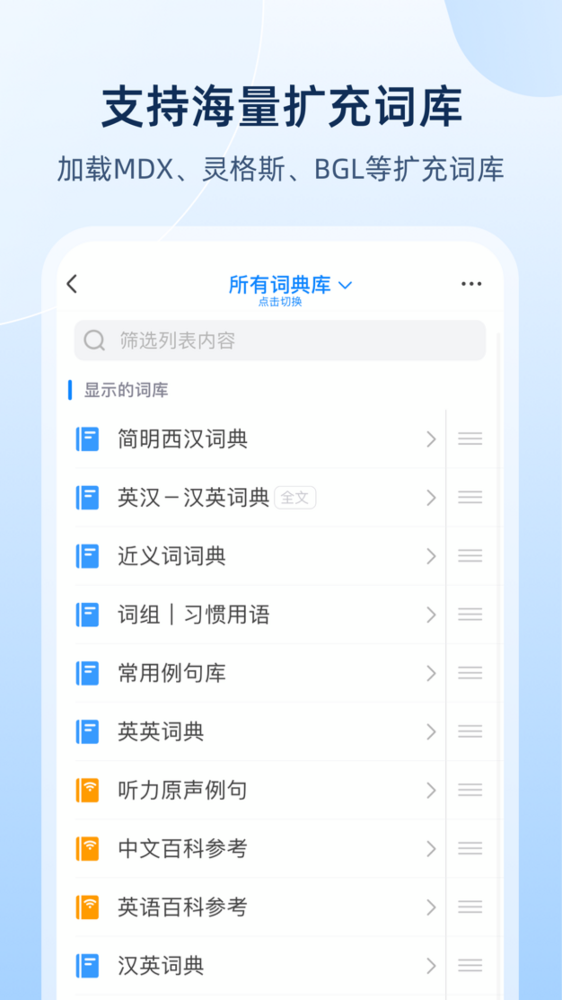
来源：同上（App Store iOS 版官方截图）。

- **布局**：分组列表（英汉/汉英/成语/惯用语/双语/英英/原声例句/百科），右侧复选框，顶部「管理」。
- **色彩**：浅色，分组分组标题灰字。
- **信息密度**：低，列表式。
- **导航**：顶栏管理入口、列表勾选。
- **可借鉴**：① 手机端「词典库勾选启用」→ 落到 unidict **移动端设置/词典管理**（现 Android 壳无词典启用管理，可补）；② 分组标题+列表。
- **不适用**：在线扩充词库下载 → 离线优先，**不引入**。

#### 图 3 · 背单词（记忆卡）
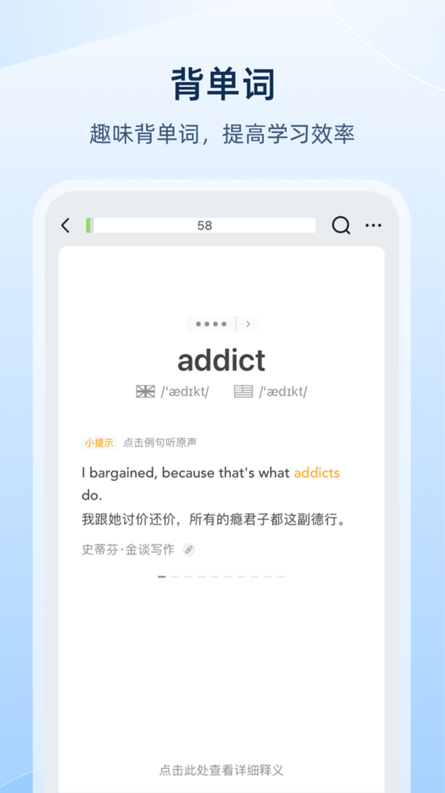
来源：同上（App Store iOS 版官方截图）。

- **布局**：全屏卡片：词头+音标+词性+释义，底部「认识/模糊」按钮，顶部进度。
- **色彩**：浅色，蓝色按钮。
- **信息密度**：极低。
- **导航**：底部自评翻页。
- **可借鉴**：三档自评卡片范式（同桌面图 4）。
- **不适用**：复习流程与 §A 冲突，**不引入**。

#### 图 4 · 学习记录 + 荧光笔
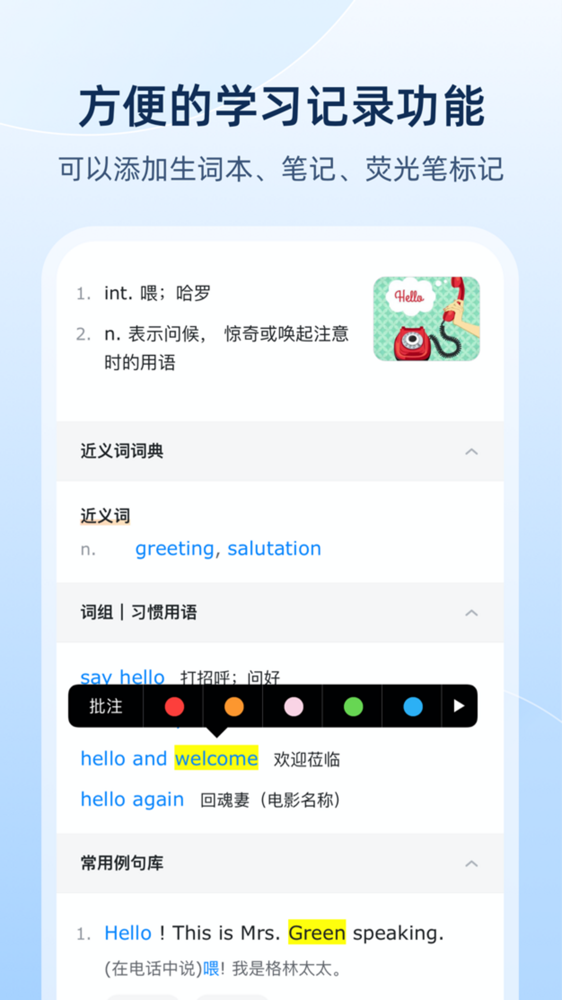
来源：同上（App Store iOS 版官方截图）。

- **布局**：词条详情+笔记区，笔记内荧光笔高亮（黄/绿/蓝多色），底部工具栏（发音/笔记/荧光笔/…）。
- **色彩**：浅色，荧光笔多色高亮。
- **信息密度**：中。
- **导航**：底栏工具切换。
- **可借鉴**：① 荧光笔多色高亮 → unidict **笔记**可补高亮（现笔记是纯文本/Markdown）；② 底部工具栏（发音/笔记/收藏）→ unidict 移动端查词页底栏。
- **不适用**：「学习记录/进度」统计 → §A 已弃，**不引入**。

#### 图 5 · 发音库设置
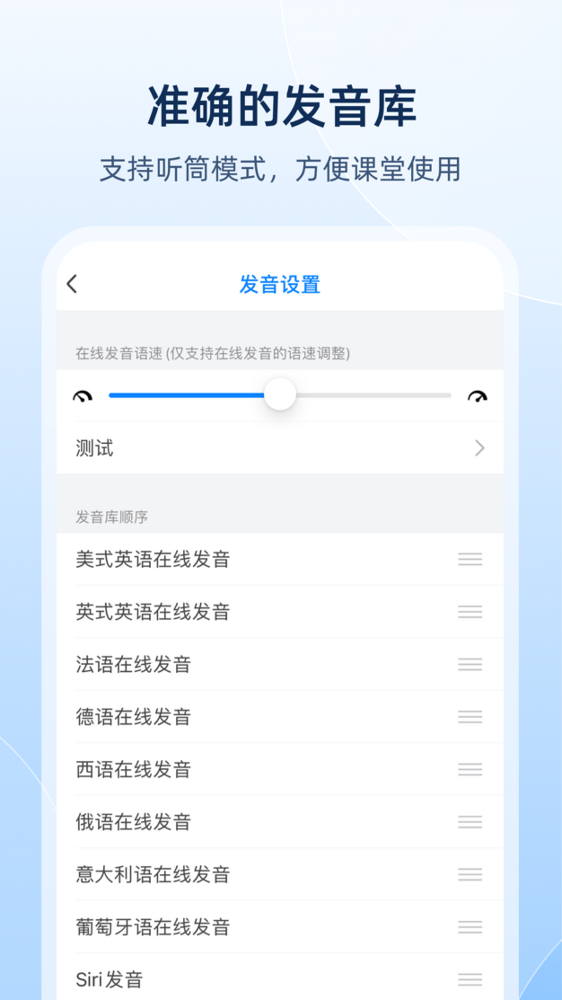
来源：同上（App Store iOS 版官方截图）。

- **布局**：发音源列表（美式/英式/法语/德语/西语/意语/葡语…在线发音），每行开关。
- **色彩**：浅色，开关蓝色。
- **信息密度**：低。
- **导航**：列表+开关。
- **可借鉴**：① 多口音/多语言发音源列表+开关 → 落到 unidict **设置「语音」tab**（现已有口音/音量/速率，可补多语言发音源开关）；② 列表+开关的简洁设置范式。
- **不适用**：在线发音源需网络（unidict 在线发音默认关、仅发查询词），**可借鉴列表交互但不引入在线源依赖**。

### 2.3 欧路小结（可落地的借鉴点）

1. **结果页分区折叠**（图 1）→ unidict 桌面 EntryResultsPane 加分区内小节折叠。
2. **取词浮窗视觉**（图 5）→ unidict QuickLookupPane 对照优化。
3. **生词本表格视图**（图 3）→ unidict 桌面生词本补表格/卡片双视图。
4. **词典启用勾选**（图 2）→ unidict 设置词典 tab + 移动端补词典管理。
5. **笔记荧光笔高亮**（图 4）→ unidict 笔记补高亮。
6. **移动端「词典/笔记」Tab**（图 1）→ unidict Android 壳查词页补笔记入口。
7. **多口音发音源列表**（图 5）→ unidict 设置语音 tab 补口音开关。

---

## 三、GoldenDict-ng（桌面对照：纯桌面，无手机 App）

> **市场结论**：GoldenDict-ng 是开源桌面词典，**只有桌面客户端，没有手机 App**。这说明「词典」品类里存在一批纯桌面、面向重度查询/翻译用户的工具型产品，与 unidict 的「离线查询」定位更接近，是比欧路更合适的桌面参照。

#### 图 1 · Windows 亮色主窗
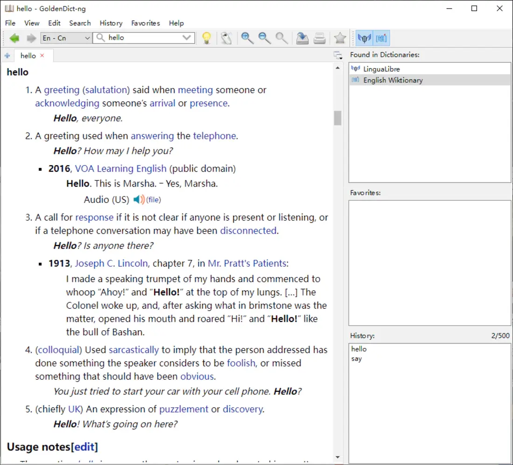
来源：GoldenDict-ng 官方文档站 img/gd_windows_white.webp（项目官方 hero 图）。

- **布局**：经典桌面三栏——顶栏菜单（File/View/Edit/Search/History/Favorites/Help）+工具栏（词典选择+搜索+多种查词模式图标）；左=词条详情（编号释义+音标+发音按钮+例句+出处+用法注）；右=Found in dictionaries（命中词典列表）+Favorites+History（2/500）。
- **色彩**：亮色，白底+黑字，链接蓝色，工具栏彩色图标。
- **信息密度**：高，一屏多栏多分区，但靠分栏而非缩字号。
- **导航**：顶栏菜单+工具栏、左栏详情、右栏命中/收藏/历史。层级偏多（传统桌面应用）。
- **可借鉴**：① 「Found in dictionaries」右栏**显示命中了哪些词典** → 落到 unidict 结果页（现按词典折叠分组，可补「命中词典」概览chip）；② History 显示「2/500」**计数** → unidict 历史可补计数；③ 多种查词模式图标化 → unidict 模式下拉可考虑图标辅助。
- **不适用**：① 顶栏多级菜单（File/Edit/View…）是传统桌面范式，unidict 用侧栏+抽屉更现代，**不引入**菜单栏；② 右栏 Favorites/History 常驻占空间，unidict 用 tab 更省，**不引入**。

#### 图 2 · macOS 暗色主窗
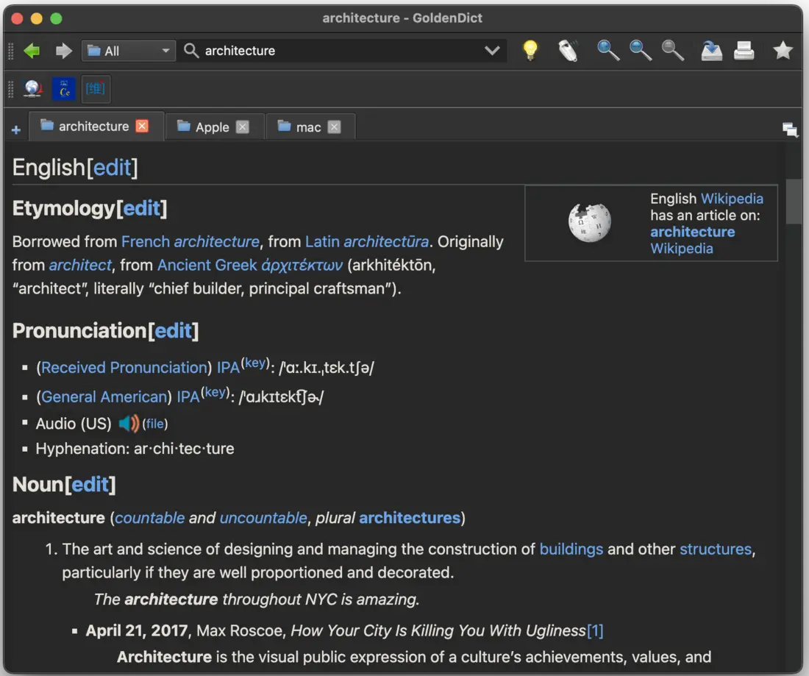
来源：GoldenDict-ng 官方文档站 img/gd_mac_black.webp。

- **布局**：与图 1 同构（工具栏+左详情+右命中），但暗色主题；多 Tab（architecture/Apple/mac）切换已打开词条。
- **色彩**：暗色，深灰底+浅字，链接亮蓝，整体高对比。
- **信息密度**：高。
- **导航**：Tab 切换词条 + 工具栏。
- **可借鉴**：① **暗色主题**的对比度处理（链接亮蓝、正文浅灰）→ unidict 已有跟随系统亮暗，可对照暗色可读性；② 多 Tab 打开多词条 → unidict 结果页可考虑多词条 Tab。
- **不适用**：暗色目前 unidict 已支持（跟随系统），无需额外引入。

#### 图 3 · Linux 亮色 + 搜索建议 + 中文词典
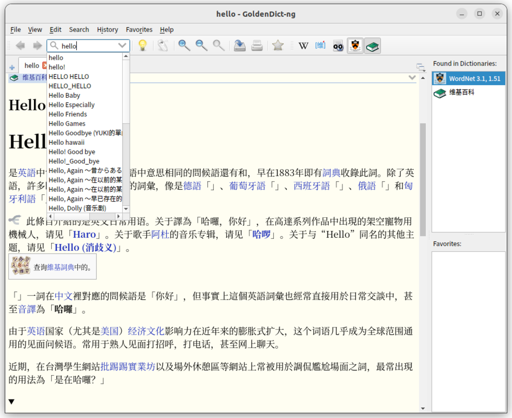
来源：GoldenDict-ng 官方文档站 img/gd_linux_genshin.webp。

- **布局**：同主窗，但搜索框激活时弹出**搜索建议下拉**（hello/Hello/HELLO/你好/hello baby/… 分组：词典命中+建议）；右栏 Found in dictionaries 显示 WordNet/维基百科；左栏中文词典释义（维基词典）。
- **色彩**：亮色，建议下拉白底+分组标题灰。
- **信息密度**：高。
- **导航**：搜索建议下拉+分组。
- **可借鉴**：① **搜索建议下拉**（输入即提示，分组：精确命中/前缀/建议）→ 落到 unidict 搜索框（现已有建议，可对照分组与排版）；② 中文维基词典的中英混排渲染。
- **不适用**：无特别不适用。

#### 图 4 · Dictionaries 管理对话框（Sources 标签）
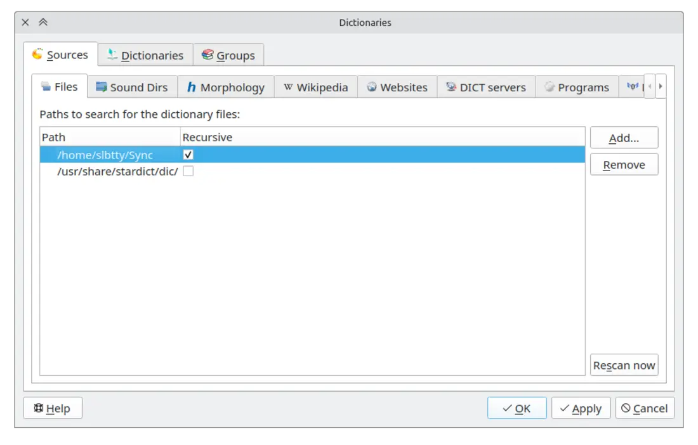
来源：GoldenDict-ng 官方文档站 manage_sources 页内嵌图 img/dict_file_tab.webp。

- **布局**：对话框，顶部 Sources/Dictionaries/Groups 三标签；Sources 下 Files/SoundDirs/Morphology/Wikipedia/Websites/DICT servers/Programs 子标签；主体=搜索路径列表（Path+Recursive 复选），Add/Remove 按钮，Rescan now。
- **色彩**：亮色，表格+复选框。
- **信息密度**：中，配置项多但分区清晰。
- **导航**：标签嵌套（源类型→路径列表）。
- **可借鉴**：① 「词典文件搜索路径+递归勾选+Rescan」的**本地词典源管理** → 落到 unidict **词典管理**（现 UNIDICT_DICTS/扫描目录，可补路径可视化与重扫）；② Sources/Dictionaries/Groups 三标签组织 → unidict 词典管理可参考。
- **不适用**：SoundDirs/Morphology/Websites/DICT servers/Programs 等源类型超出 unidict 当前格式范围，**不引入**。

#### 图 5 · 词典信息面板
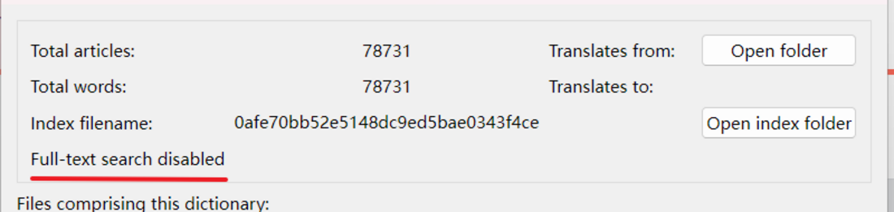
来源：GoldenDict-ng 官方文档站 custom_dictionary 页内嵌图 img/dictionary-info-fullindex.png。

- **布局**：只读信息列表——Total articles 78731 / Total words 78731 / Index filename（哈希）/ Full-text search disabled / Open folder / Open index folder 按钮。
- **色彩**：亮色，纯文本+按钮。
- **信息密度**：低。
- **导航**：只读展示+打开文件夹。
- **可借鉴**：① 展示**词条数/词条名数/全文检索是否可用**等词典元信息 → 落到 unidict 词典管理（现 cli-std --list-dicts-verbose 已有词条数，UI 可补全文检索状态、索引文件信息）；② 「Open index folder」暴露本地文件位置 → unidict 可补「打开词典目录」。
- **不适用**：无。

### 3.1 GoldenDict 小结

1. **右栏「Found in dictionaries」命中概览** → unidict 结果页补命中词典 chip。
2. **搜索建议分组下拉** → unidict 搜索框建议对照优化。
3. **本地词典源路径管理+重扫** → unidict 词典管理补路径可视化与重扫。
4. **词典元信息面板**（词条数/全文检索状态/索引文件）→ unidict 词典管理补信息展示。
5. **暗色对比度** → unidict 暗色可读性对照。
6. **传统菜单栏不引入**（unidict 侧栏+抽屉更现代）。

---

## 四、MDict（手机对照 + 桌面说明）

> MDict 是老牌词典格式 + 多端客户端（iOS/Android/Windows）。**桌面端官网不发布纯净 UI 截图**，故桌面仅一张宣传图（如实标注）。手机端截图充足。

### 4.1 手机端（iOS 客户端）

#### 图 1 · 词条详情（蝴蝶·中文词典）
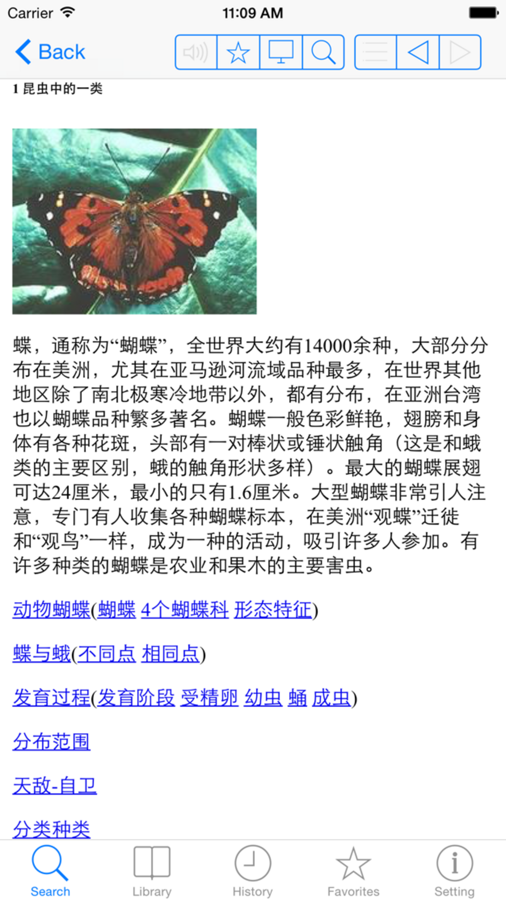
来源：App Store「MDict」iOS 版官方截图（Apple CDN）。

- **布局**：顶部搜索+返回；词条=词头+配图+分区列表（基本解释/详细解释/康熙字典/康熙字典…）；底部 Tab（词典/笔画/部首/…）。
- **色彩**：浅色，配图彩色，分区标题加粗。
- **信息密度**：中高。
- **导航**：顶栏搜索、底栏 Tab、页内分区。
- **可借鉴**：① **词条配图**（蝴蝶图）→ unidict MDict .mdd 资源已可渲染图片，移动端可强化配图展示；② 分区列表+康熙字典等中文辞书分区。
- **不适用**：底部「笔画/部首」是中文特有检索，unidict 面向英文为主，**不引入**。

#### 图 2 · person 高密度查询
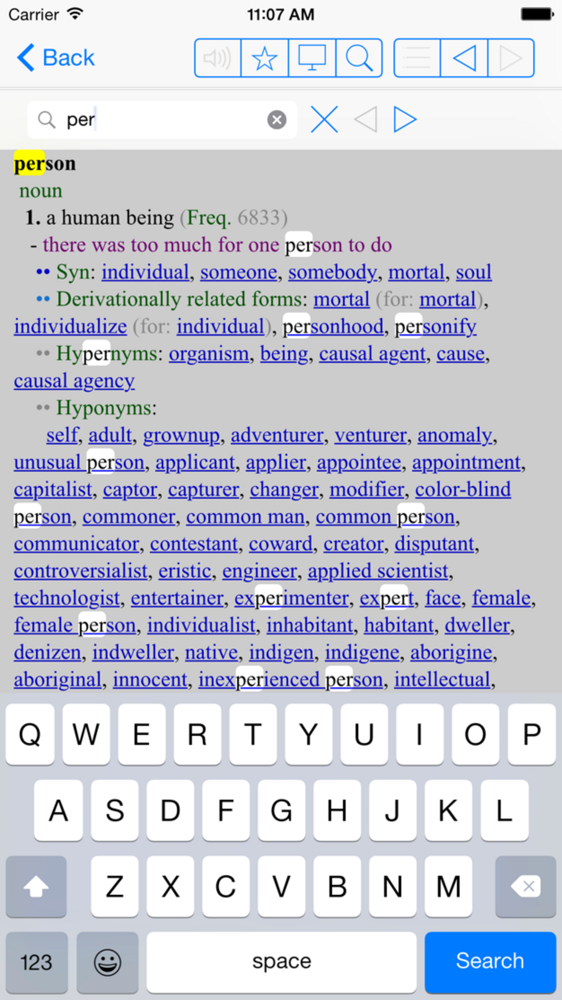
来源：同上（App Store iOS 版官方截图）。

- **布局**：词头+音标+词性，下接高密度分区（释义/词形变化/同近义词/词汇辨析/常用短语/词语辨析/词根词缀…），底部弹出键盘。
- **色彩**：浅色，纯文本，分区标题加粗+缩进。
- **信息密度**：**极高**，一屏塞满多分区，靠标题层级而非留白。
- **导航**：页内锚点+底部键盘。
- **可借鉴**：① **高密度多分区**的取舍——MDict 选择「塞满」，unidict 选择「折叠」，两者可结合：默认折叠、可展开看全；② 词形变化/词根词缀等分区 → unidict 内容 Tab 已有近义联想/词组，可补词形变化。
- **不适用**：纯塞满式密度在移动小屏易拥挤，**不全盘借鉴**，取「分区+可折叠」。

#### 图 3 · 搜索建议
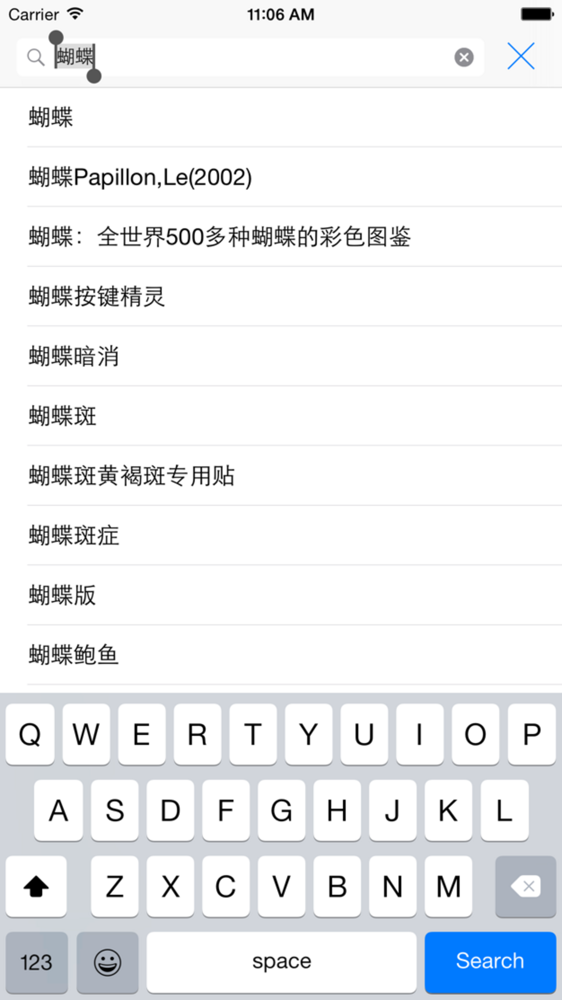
来源：同上（App Store iOS 版官方截图）。

- **布局**：搜索框+建议列表（NewGroup/WordNet3.0_v2/Vb2012/ETDict 分组 + 蝴蝶/蝴蝶兰/蝴蝶果… 词条建议），底部键盘。
- **色彩**：浅色，分组标题灰。
- **信息密度**：中。
- **导航**：建议列表+键盘。
- **可借鉴**：① 搜索建议**分组**（词典组/词条）→ unidict 搜索建议对照；② 中文词条建议（蝴蝶兰/蝴蝶果）。
- **不适用**：无。

#### 图 4 · 词典管理（Dicts 标签）
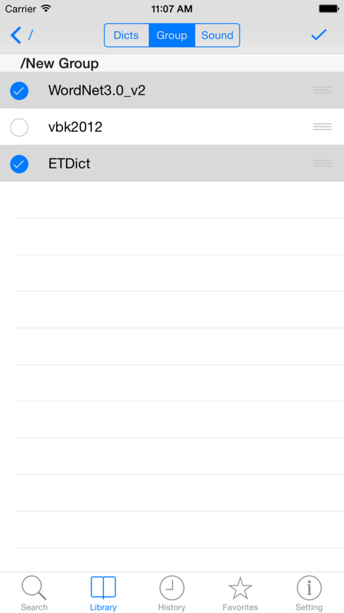
来源：同上（App Store iOS 版官方截图）。

- **布局**：顶部 Group/Dicts/Sound 三标签；Dicts 下=词典列表（WordNet3.0_v2/Vb2012/ETDict）+复选框。
- **色彩**：浅色。
- **信息密度**：低。
- **导航**：标签+列表勾选。
- **可借鉴**：① 手机端**词典勾选启用**（同欧路图 2）→ unidict Android 壳补词典管理；② Group/Dicts/Sound 标签组织。
- **不适用**：Sound 标签（发音库）unidict 已有语音设置，**合并即可**。

#### 图 5 · All Dictionaries（键盘态）
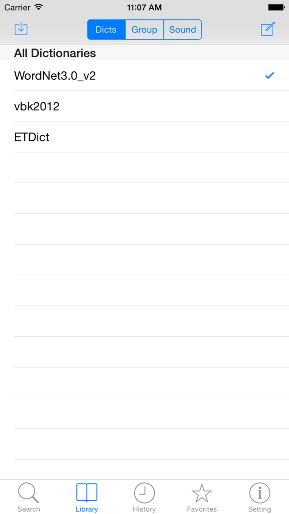
来源：同上（App Store iOS 版官方截图）。

- **布局**：搜索框+词典列表+底部 QWERTY 键盘，Search 按钮。
- **色彩**：浅色，键盘系统灰。
- **信息密度**：低。
- **导航**：搜索+列表。
- **可借鉴**：搜索框+键盘的输入范式（标准 iOS 模式）。
- **不适用**：无。

### 4.2 桌面端（Windows 客户端）

#### 图 1 · 官网宣传图（非纯净 UI）

来源：MDict 官网 mdict.cn/wp-content/uploads/2016/07/Show.jpg。

- **说明**：这是官网**宣传图**（手机+书本场景），内嵌一小块**手机界面**（中文词典「subdeluvian」释义）。**不是纯净的 Windows 桌面 UI 截图**——MDict 官网与下载页均不发布桌面 UI 截图。
- **可借鉴**：图中手机界面显示 MDict 的中文词典渲染（词性/释义/例句），佐证 MDict 移动端中文辞书能力。
- **不适用**：宣传图不能作为桌面 UI 依据，**桌面端 MDict 不作 UI 参照**（仅确认其产品形态：iOS/Android/Windows 三端 + 桌面端存在）。

### 4.3 MDict 小结

1. **词条配图** → unidict 移动端强化 .mdd 配图。
2. **搜索建议分组** → unidict 搜索建议对照。
3. **手机端词典勾选启用** → unidict Android 壳补词典管理。
4. **词形变化分区** → unidict 内容 Tab 可补。
5. **桌面端无纯净截图**，不作 UI 参照（诚实标注）。

---

## 五、三家横向对照

| 维度 | 欧路词典 Eudic | GoldenDict-ng | MDict | unidict 现状 |
|---|---|---|---|---|
| 形态 | 桌面+手机 | 仅桌面 | 桌面+手机 | 桌面(QML)+手机(Android壳) |
| 桌面布局 | 三栏（词典树/详情/学习） | 三栏（菜单/详情/命中+历史） | 官网无纯净图 | 侧栏+结果面板（词典折叠分组） |
| 手机布局 | 搜索+分区详情+底Tab | — | 搜索+分区详情+底Tab | 单页查词+词本 |
| 色彩 | 浅色为主，低饱和 | 亮/暗双主题 | 浅色 | 跟随系统亮暗 |
| 信息密度 | 中（折叠分区） | 高（多栏多分区） | 极高（塞满） | 中（折叠分组） |
| 查词触发 | 搜索+鼠标取词浮窗 | 搜索+工具栏多模式 | 搜索 | 搜索+剪贴板/热键+悬浮窗 |
| 词典管理 | 复选框启用+分组树 | 源路径+重扫+信息面板 | 复选框启用 | 优先级/分组+环境变量/扫描 |
| 笔记/高亮 | 荧光笔高亮 | — | — | 纯文本/Markdown |
| 学习体系 | 有（背单词/熟练度/进度） | 无 | 无 | 无（§A 已弃） |
| 在线商店 | 有（扩充词库） | 无 | 无 | 无（P-10 gated） |

**关键结论**：
- **欧路**是「词典+学习」综合体，视觉最现代、最干净，但大量功能（学习进度/背单词/在线商店/AI大模型）与 unidict 定位冲突，**只借视觉与交互，不借功能**。
- **GoldenDict** 是纯工具型桌面词典，与 unidict 定位最接近，其**命中概览/搜索建议/词典源管理/元信息面板**最值得借鉴。
- **MDict** 手机端的**配图/搜索建议分组/词典勾选**可借；桌面端无纯净截图，不作参照。
- **GoldenDict 无手机 App** 说明词典品类存在纯桌面工具层，unidict 桌面端可安心做「工具型」而不必强求全功能。

---

## 六、unidict UI 改版方案（待用户过目，过目后才动 UI 代码）

> 原则：**只借视觉与交互范式，不借与 §A/roadmap 冲突的功能**（不引入学习进度/背单词/在线商店/AI大模型/鼠标悬停取词）。

### 6.1 桌面端（qmlui / MainDesktop.qml）

| 页面/组件 | 改版动作 | 借鉴来源 |
|---|---|---|
| **结果页 EntryResultsPane** | ① 加分区内小节折叠（例句/词组/近义联想可折叠）；② 结果顶部补「命中词典」chip 概览 | 欧路图1 / GoldenDict图1 |
| **搜索框建议** | 建议下拉分组（精确命中/前缀/词条），优化排版 | GoldenDict图3 / MDict图3 |
| **生词本** | 补「表格/卡片」双视图切换（单词+释义+添加时间） | 欧路图3 |
| **悬浮取词窗 QuickLookupPane** | 对照优化信息层级：词头/音标/释义/发音/生词本排布，半透明深色可读性 | 欧路图5 |
| **设置抽屉「词典」tab** | 补「启用/停用」勾选 + 词典元信息（词条数/全文检索状态/索引文件）+ 打开词典目录 | GoldenDict图4/图5 |
| **设置抽屉「语音」tab** | 补多口音/多语言发音源开关列表 | 欧路图5 |
| **词典管理** | 补本地词典源路径可视化 + 重扫按钮 | GoldenDict图4 |
| **历史** | 补命中计数（如 2/500） | GoldenDict图1 |
| **笔记** | 补荧光笔高亮（多色） | 欧路图4 |
| **暗色主题** | 对照 GoldenDict 暗色，校验链接/正文对比度 | GoldenDict图2 |

### 6.2 手机端（Android 原生壳，Compose/Kotlin）

| 页面 | 改版动作 | 借鉴来源 |
|---|---|---|
| **查词详情页** | ① 补「词典/笔记」Tab 切换释义与笔记；② 补笔记荧光笔高亮；③ 强化 .mdd 词条配图展示 | 欧路手机图1/图4 / MDict图1 |
| **搜索建议** | 建议分组（词典/词条） | MDict图3 |
| **设置/词典管理** | 补手机端词典勾选启用（Group/Dicts 标签） | 欧路手机图2 / MDict图4 |
| **查词页底栏** | 补底部工具栏（发音/笔记/收藏） | 欧路手机图4 |

### 6.3 明确不引入（避免踩 §A/roadmap 红线）

- 学习进度/熟练度/背单词/遗忘曲线复习（§A 已弃）。
- 在线词典商店/扩充词库下载（P-10 gated，离线优先）。
- AI 大模型在线翻译（需 provider 基建；unidict 走本地外部命令桥）。
- 鼠标悬停自动取词（§A 已弃；unidict 用剪贴板/热键）。
- 传统桌面菜单栏（unidict 侧栏+抽屉更现代）。

### 6.4 建议实施顺序（过目后）

1. **低成本高收益**（先做）：结果页分区折叠、命中词典 chip、搜索建议分组、历史计数。
2. **中成本**：生词本表格视图、词典元信息面板、笔记荧光笔、暗色对比度校验。
3. **手机端**：查词页笔记 Tab + 配图强化、词典勾选管理。
4. **取词浮窗**：QuickLookupPane 视觉对照优化。

---

## 附录 · 图片来源清单

| 文件 | 产品/形态 | 来源 |
|---|---|---|
| assets/eudic-desktop-01..06 | 欧路词典 macOS 客户端 | iTunes App Store「Eudic 欧路词典」macOS 版官方截图（Apple CDN 800×500） |
| assets/eudic-mobile-01..05 | 欧路词典 iOS 客户端 | iTunes App Store「欧路词典」iOS 版官方截图（Apple CDN） |
| assets/goldendict-desktop-01..05 | GoldenDict-ng Win/mac/Linux 客户端 | GoldenDict-ng 官方文档站 xiaoyifang.github.io/goldendict-ng/img/ |
| assets/mdict-mobile-01..05 | MDict iOS 客户端 | iTunes App Store「MDict」iOS 版官方截图（Apple CDN） |
| assets/mdict-desktop-01-promo | MDict 官网宣传图 | mdict.cn/wp-content/uploads/2016/07/Show.jpg（**宣传图，非纯净桌面 UI**） |
